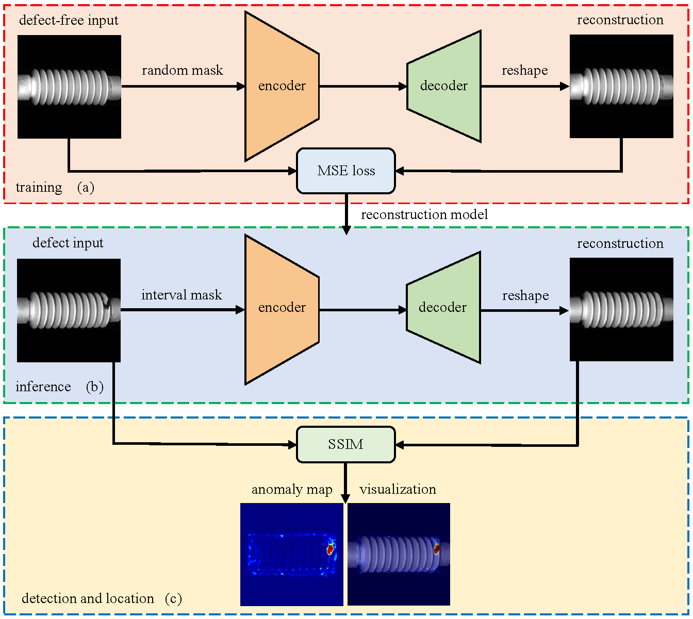
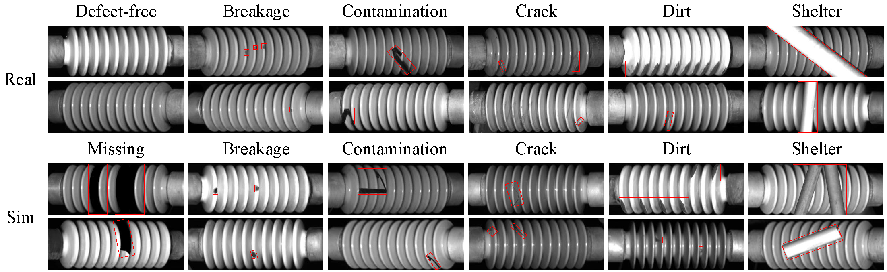
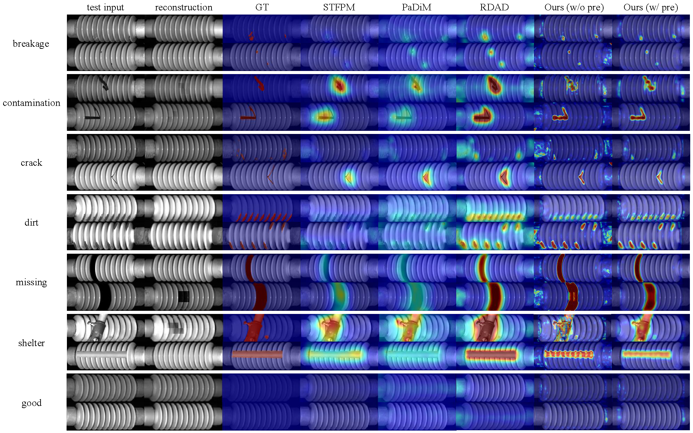

## Insulator-Defect-Detection
Official PyTorch Implementation of Catenary Insulator Defects Detection: A Dataset and an Unsupervised Baseline, Accepted by IEEE TIM.


### Datasets
Catenary Insulator Defect dataset (CID): Download from [[BaiDu]](https://pan.baidu.com/s/10rvDcGUXvNHSSc7Alcr7lA?pwd=30qh) [[Google Drive]](https://drive.google.com/drive/folders/1JW2-_LsmwQkYQkZ23zLAD124ZGNOAtkA?usp=sharing)

Statistical Overview of CID
<table>
    <tr>
        <th colspan=2></th>
        <th>Train</th>
        <th>Test_Real</th>
        <th>Test_Sim</th>
        <th>Test_All</th>
    </tr>
    <tr>
    <th colspan=2 >Defect-free Image</th>
        <!-- bgcolor=#ffffcc-->
        <td>3900</td>
        <td>0</td>
        <td>0</td>
        <td>33</td>
    </tr>
    <tr>
        <td rowspan=6>Defect<br>Image</td>
        <td>breakage</td>
        <td>0</td>
        <td>26</td>
        <td>34</td>
        <td>60</td>
    </tr>
        <td>contamination</td>
        <td>0</td>
        <td>5</td>
        <td>55</td>
        <td>60</td>
    </tr>
        <td>crack</td>
        <td>0</td>
        <td>2</td>
        <td>58</td>
        <td>60</td>
    </tr>
        <td>dirt</td>
        <td>0</td>
        <td>54</td>
        <td>6</td>
        <td>60</td>
    </tr>
        <td>missing</td>
        <td>0</td>
        <td>0</td>
        <td>60</td>
        <td>60</td>
    </tr>
        <td>shelter</td>
        <td>0</td>
        <td>40</td>
        <td>20</td>
        <td>60</td>
    </tr>
    <tr>
        <td colspan=2 >Total</td>
        <td>3900</td>
        <td>160</td>
        <td>233</td>
        <td>393</td>
    </tr>
</table>

Some Example of CID


The dataset should be placed in the 'data' folder. 
The training dataset should only contain defect-free samples, which should be named 'good'. 
The test dataset should include one category named 'good' for defect-free samples, and any other subcategories of defect samples. It should be made as follows:

```shell
data
|---- insulator
|-----|------ ground_truth
|-----|------|------ teat_all
|-----|------|------ test_real
|-----|------|------ test_sim
|-----|------ test_all
|-----|------|------ good
|-----|------|------ ...
|-----|------|------ ...
|-----|------ test_real
|-----|------|------ good
|-----|------|------ ...
|-----|------|------ ...
|-----|------ test_sim
|-----|------|------ good
|-----|------|------ ...
|-----|------|------ ...
|-----|------ train
|-----|------|------ good
```

### Environment
This repository is implemented and tested on Python 3.9 and PyTorch 1.10.
To install requirements:

```setup
pip install-r requirements.txt
```

### Usage
To train theMAE model, run:

```train
python train.py --batch_size 32 --epoch 2000 --model mae_vit_base_patch16 --output_dir ./checkpoints/insulator --log_dir ./checkpoints/insulator --data_path ./data/insulator --input_size 224 --blr 5e-3 --device_select 0
```

To evaluate and test the model, run:

```eval
for w/o pre
python inference.py --input_size=224 --mask_size=16 --test_fold="test_all" --save_dir ./results
for w/ pre
python inference_pre.py --input_size=224 --mask_size=16 --test_fold="test_real" --save_dir ./results_pre
for upper bound
python inference_ub.py --input_size=224 --mask_size=16 --test_fold="test_sim" --save_dir ./results_ub
```

Before running, you can download the model checkpoints directly from [[BaiDu]](https://pan.baidu.com/s/1yZPldDMjOLWhA3Z4plT__w?pwd=xynr)
The checkpoints should be placed in the 'checkpoints' folder. It should be made as follows:
```shell
checkpoints
|---- insulator
|-----|------ 224-10.pth
|-----|------ 224-20.pth
|-----|------ 224.txt
|-----|------ ...
|-----|------ ...
|-----|------ ...
```

### Result
Running the code as explained in this file should achieve the following results for CID:

Defect Detection (Image AUROC, P, R, F1) and Defect Localization (Pixel AUROC, P, R, F1)

<table>
    <tr>
        <th> </th>
        <th>Method</th>
        <th>AUROC</th>
        <th>P</th>
        <th>R</th>
        <th>F1</th>
    </tr>
    <tr>
        <th rowspan=3>Image-level<br>Detection</th>
        <td>w/o pre</td>
        <td>99.21/99.48/99.39</td>
        <td>98.44/98.72/99.17</td>
        <td>99.21/99.14/99.21</td>
        <td>0.99/0.99/0.99</td>
    </tr>
        <td>w/ pre</td>
        <td>99.24/99.60/99.47</td>
        <td>98.44/99.14/99.44</td>
        <td>99.21/99.14/99.17</td>
        <td>0.99/0.99/0.99</td>
    </tr>
        <td>Upper Bound</td>
        <td>100.0/100.0/100.0</td>
        <td>100.0/100.0/100.0</td>
        <td>100.0/100.0/100.0</td>
        <td>1.00/1.00/1.00</td>
    </tr>
        <tr>
        <th rowspan=3>Pixel-level<br>Localization</th>
        <td>w/o pre</td>
        <td>95.59/98.18/97.13</td>
        <td>58.05/66.59/63.58</td>
        <td>72.15/77.31/75.51</td>
        <td>0.63/0.70/0.68</td>
    </tr>
        <td>w/ pre</td>
        <td>95.70/98.29/97.37</td>
        <td>58.06/66.53/63.52</td>
        <td>71.67/77.15/75.26</td>
        <td>0.63/0.70/0.68</td>
    </tr>
        <td>Upper Bound</td>
        <td>96.94/99.49/98.59</td>
        <td>59.38/68.73/65.42</td>
        <td>75.20/79.34/77.90</td>
        <td>0.65/0.73/0.70</td>
    </tr>
</table>

### Visualization examples



### Acknowledgement

We use some codes from repositories including [MAE](https://github.com/facebookresearch/mae)

### License
This project is under the MIT license. See [LICENSE](./LICENSE) for details.